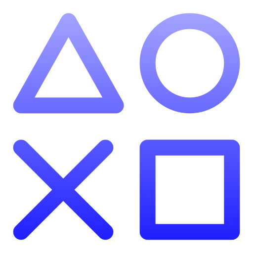
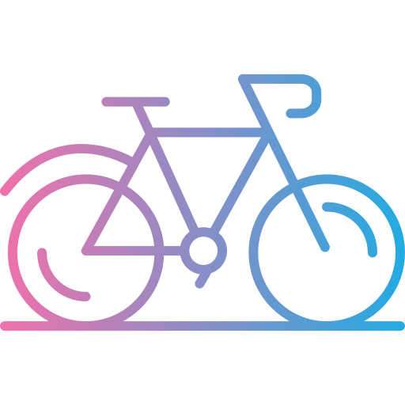

<!-- Image -->
<!-- Updated Image -->

<!-- Header -- , In development -->

<h3 align="center" margin style="color:#4caf50;">
  A Passionate Student of Software and Geodetic Engineering from Bogotá, Colombia
</h3>

---

### About Me 🚀

- 🔭 I’m currently working on **Portfolio, Engineering Software Project.**
- 🌱 I’m currently learning **React, Node.js, Next.js**

  

- 💬 Ask me about **Cartography, Data Science, Machine Learning, Web Development**
- 📫 How to reach me: **Search me on LinkedIn, Instagram**
- ⚡ Fun fact: **Chess**

---

### Connect with Me 🌐

  
  
  

---

### Tech Stack 🛠️

  

---

### GitHub Stats 📊

  
  

---

### Popular Repositories 📊

---

### My Hobbies & Interests 🎨

  <table style="border:none;">
    <tr>
      <td align="center" width="200">
        
        <h3 style="color:#7aa2f7">Music</h3>
        
Listening and enjoying musical bands.

      </td>
      <td align="center" width="200">
        
        <h3 style="color:#7aa2f7">Gaming</h3>
        
Adventure games and open worlds.

      </td>
      <td align="center" width="200">
        
        <h3 style="color:#7aa2f7">Maths</h3>
        
Calculus and statistics.

      </td>
    </tr>
    <tr>
      <td align="center" width="200">
        
        <h3 style="color:#7aa2f7">Chess</h3>
        
Strategic and tactical games.

      </td>
      <td align="center" width="200">
        
        <h3 style="color:#7aa2f7">Traveling</h3>
        
Exploring new places and cultures.

      </td>
      <td align="center" width="200">
        
        <h3 style="color:#7aa2f7">Ride Bike</h3>
        
I enjoy riding my bike and exploring new places.

      </td>
    </tr>
  </table>

---

# My 3D Contribution Calendar

Here is my GitHub 3D contribution calendar:

---

### Quote

  

