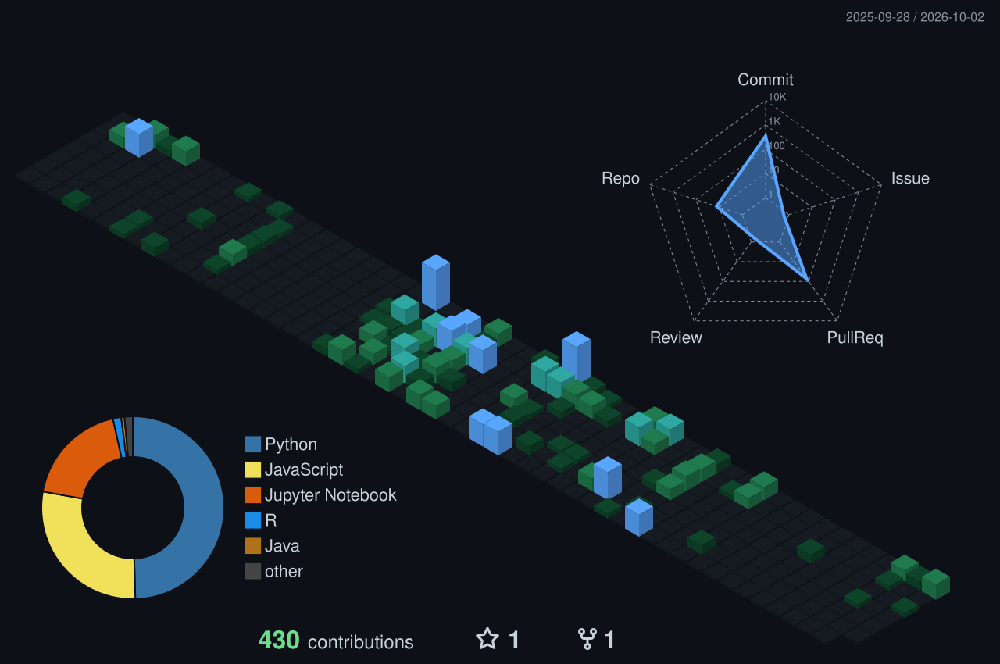
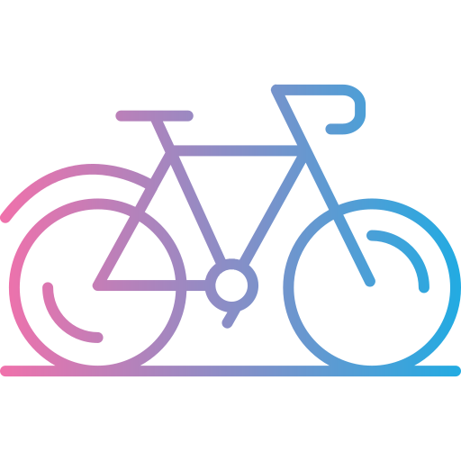

 

   

---

## 👨‍💻 About Me

I'm a software and topographic engineering student who loves mathematics and turning spatial data into useful software. I enjoy the space where **maps, data and the web** meet: from hydro-meteorological dashboards to full-stack web apps.

- 🔭 Currently working on **[DroughtMonitor (SIPREH)](https://github.com/MSOR03/SIPREH)**, a drought monitoring and prediction platform for Colombia
- 🌱 Currently learning **React, Node.js and Next.js**
- 💬 Ask me about **Cartography, GIS, Data Science, Machine Learning and Web Development**
- 📐 Into **calculus, statistics** and numerical methods (FEM)
- ♟️ Fun fact: I can talk about **chess** openings for hours
- 📫 Reach me on **[LinkedIn](https://www.linkedin.com/in/sebastian-olarte-ramirez-b34966295/)**

---

## 🛠️ Tech Stack

**Languages**

**Frameworks & Databases**

**Tools**

---

## 🚀 Featured Projects

| Project | Description | Stack |
| :-- | :-- | :-- |
| 🌧️ **[DroughtMonitor (SIPREH)](https://github.com/MSOR03/SIPREH)** | Web platform for monitoring, historical analysis and prediction of droughts in Colombia using CHIRPS, ERA5 and IMERG data | Python · FastAPI · Next.js |
| 🌐 **[Red-Bacatá](https://github.com/MSOR03/Red-Bacata)** | Website for a research group at Universidad Distrital | HTML · CSS |
| 🧩 **[MyChazapp](https://github.com/MSOR03/MyChazapp)** | Visual, interactive data structures (built together with CeeMC) | JavaScript |
| 🔐 **[VPN](https://github.com/MSOR03/VPN)** | A simple VPN implemented from cryptographic theory | — |
| ⚙️ **[Parallel & Distributed Computing](https://github.com/MSOR03/Parallel_distribuited_computing)** | Parallel and distributed computing exercises | Java |
| 💼 **[Portfolio](https://github.com/MSOR03/Portfolio)** | My personal portfolio, showing my skills and projects | JavaScript |

---

## 📊 GitHub Stats

---

## 🧱 3D Contribution Calendar

  <picture>
    <source media="(prefers-color-scheme: dark)" srcset="profile-3d-contrib/night.svg" />
    <source media="(prefers-color-scheme: light)" srcset="profile-3d-contrib/day.svg" />
    
  </picture>

---

## 🎨 Hobbies & Interests

<table>
  <tr>
    <td align="center" width="160">
       
      <b>Music</b> 
      Listening to and enjoying bands
    </td>
    <td align="center" width="160">
       
      <b>Gaming</b> 
      Adventure and open-world games
    </td>
    <td align="center" width="160">
       
      <b>Maths</b> 
      Calculus and statistics
    </td>
  </tr>
  <tr>
    <td align="center" width="160">
       
      <b>Chess</b> 
      Strategy and tactics
    </td>
    <td align="center" width="160">
       
      <b>Traveling</b> 
      Exploring new places and cultures
    </td>
    <td align="center" width="160">
       
      <b>Cycling</b> 
      Riding my bike around the city
    </td>
  </tr>
</table>

---

Thanks for visiting! ⭐ Feel free to explore my repositories.

